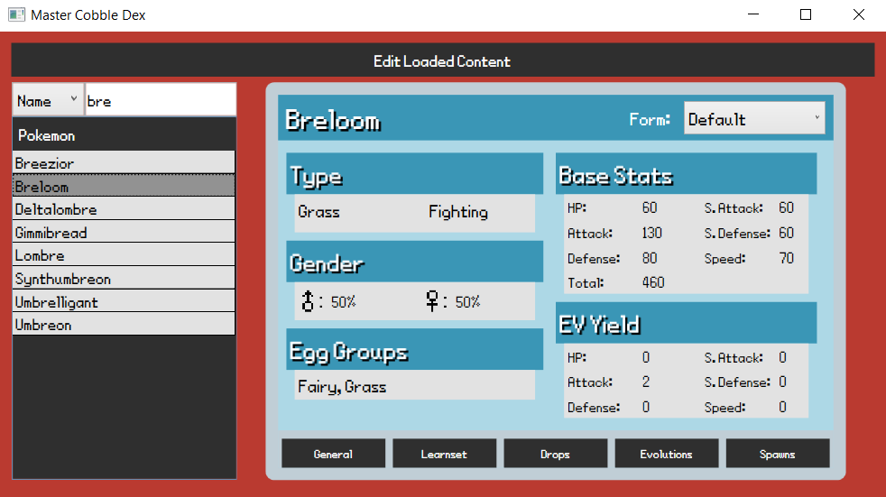
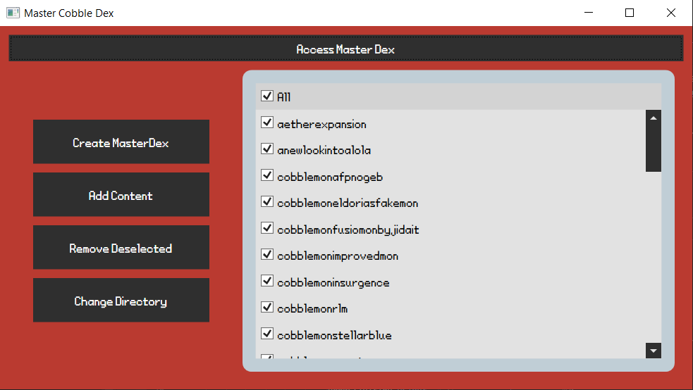

Creates a master pokedex by uploading cobblemon and any addons to the app

This program is made in mind for cobblemon modpacks that include addons with little to no documentation on the changes or additions made. It's also made for people that wish to have information of all pokemon on hand without the need of obtaining the pokemon ingame. The information includes base stats, movesets, drops, evolutions, and spawn conditions.

 
 

